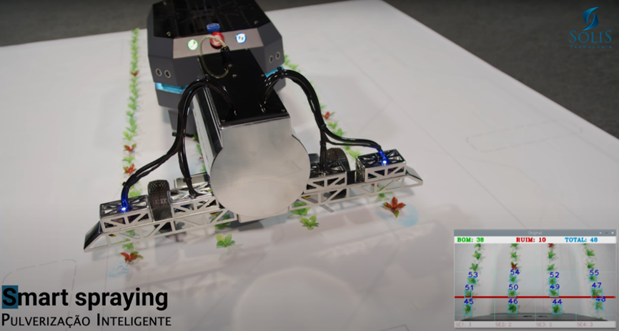

# Challenge 005 - SOBOT Agritech CONTROL

## 🎯 Challenge Objective
The objective of this challenge is to use computer vision concepts together with the Agritech Module, performing color detection and simulating the application with sprayers.

### Basic
1. **Assembly of the Agritech Module:**
    Follow the assembly instructions for the Agritech module as provided in our video available on [YouTube](https://www.youtube.com/watch?v=kt1ajyvTT6U&list=PLJpodHj3AF0-VNTDBlsqiOu7pw9HkQsv-&index=5) and the “APOSTILA SOBOT” (2ª Edição – 2024, p. 84).

    CAUTION: Ensure the electrical connections of the Agritech module follow the instructions in the “APOSTILA SOBOT” (2ª Edição – 2024, p. 88) to avoid electrical damage.

2. **Programming:**
After assembling the Agritech module, implement a program to activate the tank valves.

### Intermediate
After assembling the Agritech module, develop a program for color recognition using computer vision.

Use the OpenCV library with Python, which comes pre-installed on the SoBot's Raspberry Pi. Numerous tutorials are available online, and there is an example using this library in our GitHub repository.

### Advanced
After completing the Agritech module assembly and programming for color recognition, simulate the application of agricultural sprays using the red and green EVA sheets from the Agritech kit.

The program should be able to count the total and individual occurrences of green and red detected colors, applying the spray only where red is detected.

## 🌟Tips
Refer to the **Commands for controlling digital outputs** section in the Command Guide.
Watch videos on the [YouTube Channel](https://www.youtube.com/@solistecnologia/videos).
Check out example programs on GitHub: [Sobot AgriTech](https://github.com/SolisTecnologia/SoBot-Agri-Tech)